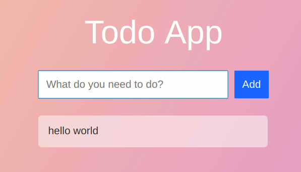

# To-do Web App with React

Example of a To-do app built with React.




## Getting Started

These instructions will get you a copy of the project up and running on your local machine for development and testing purposes. See deployment for notes on how to deploy the project on a live system.

### Prerequisites

Have NPM and Node.js installed.

### Installing

A step by step series of examples that tell you have to get a development env running

```
git clone https://github.com/zutton/todo-react.git

cd todo-react
npm install
```

To get up in running use:

```
npm start
```
Available to view on ```http://localhost:3000```

## Deployment

how to deploy production build on a live system

```
npm run build
```

To view on localhost:3000

```
npm run start:prod
```

## Built With

* [React](https://github.com/facebook/react) - JavaScript library for building user interfaces
* [Razzle](https://github.com/jaredpalmer/razzle) - Web app setup
* [FlipMove](https://github.com/joshwcomeau/react-flip-move) - Effortless animation between DOM changes


## Authors

* **Blake Sutton** 

## License

MIT License
